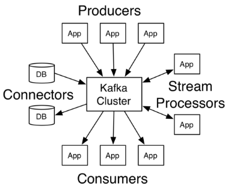
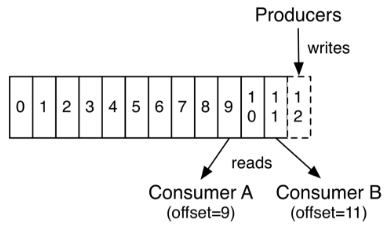

# KAFKA Study

一说到KAFKA 就想到Java 气啊  
老牌的JAVA的适用于大规模通讯的Message queue  持久化存储消息到硬盘

### 先搭环境把
``` 
version: '3'
services:
  zookeeper:
    image: wurstmeister/zookeeper
    ports:
      - "2181:2181"
  kafka:
    image: wurstmeister/kafka
    ports:
      - "9092:9092"
    environment:
      KAFKA_ADVERTISED_HOST_NAME: 192.168.2.200
      KAFKA_CREATE_TOPICS: "test:1:1"
      KAFKA_ZOOKEEPER_CONNECT: zookeeper:2181
    volumes:
      - /var/run/docker.sock:/var/run/docker.sock
```
### 基础概念
- topics 主题
- 记录  包含    K,V,timestamp
- Producer   生产者 (发布记录到一个或在多个topics)
- Consumer   消费者 (订阅一个或在多个topics)
- Streams    流API (允许应用程序充当流处理器，从一个或多个topics（主题）消耗的输入流，并产生一个输出流至一个或多个输出的topics（主题），有效地变换所述输入流，以输出流。)
- Connector  连接器 (允许构建和运行kafka topics（主题）连接到现有的应用程序或数据系统中重用生产者或消费者)


### Topics主题 和 partitions分区
- 一个Topic可以认为是一类消息，每个topic将被分成多个partition(区),每个partition在存储层面是append log文件
- 主题是发布记录的类别或订阅源名称。Kafka的主题总是多用户; 也就是说，一个主题可以有零个，一个或多个消费者订阅写入它的数据。
- 对于每个主题，Kafka群集都维护一个如下所示的分区日志：


- 每个分区都是一个有序的，不可变的记录序列，不断附加到结构化的提交日志中。分区中的记录每个都分配了一个称为偏移的顺序ID号，它唯一地标识分区中的每个记录。
- Kafka集群持久保存所有已发布的记录 - 无论是否已使用 - 使用可配置的保留期。例如，如果保留策略设置为两天，则在发布记录后的两天内，它可供使用，之后将被丢弃以释放空间。Kafka的性能在数据大小方面实际上是恒定的，因此长时间存储数据不是问题。



   实际上，基于每个消费者保留的唯一元数据是该消费者在日志中的偏移或位置。这种偏移由消费者控制：通常消费者在读取记录时会线性地提高其偏移量，但事实上，由于该位置由消费者控制，因此它可以按照自己喜欢的任何顺序消费记录。例如，消费者可以重置为较旧的偏移量来重新处理过去的数据，或者跳到最近的记录并从“现在”开始消费。

　　这些功能组合意味着Kafka 消费者consumers 非常cheap - 他们可以来来往往对集群或其他消费者没有太大影响。例如，您可以使用我们的命令行工具“tail”任何主题的内容，而无需更改任何现有使用者所消耗的内容。

　　日志中的分区有多种用途。首先，它们允许日志扩展到超出适合单个服务器的大小。每个单独的分区必须适合托管它的服务器，但主题可能有许多分区，因此它可以处理任意数量的数据。其次，它们充当了并行性的单位 - 更多的是它。

### Producers生产者 和 Consumers消费者
#### Producers生产者
　　Producers 将数据发布到指定的topics 主题。同时Producer 也能决定将此消息归属于哪个partition;比如基于"round-robin"方式或者通过其他的一些算法等。
#### Consumers
- 本质上kafka只支持Topic.每个consumer属于一个consumer group;反过来说,每个group中可以有多个consumer.发送到Topic的消息,只会被订阅此Topic的每个group中的一个consumer消费。
- 如果所有使用者实例具有相同的使用者组，则记录将有效地在使用者实例上进行负载平衡。
- 如果所有消费者实例具有不同的消费者组，则每个记录将广播到所有消费者进程。


### 设置kafka外网 IP
``` 
listeners=PLAINTEXT://0.0.0.0:9092

# Hostname and port the broker will advertise to producers and consumers. If not set,
# it uses the value for "listeners" if configured.  Otherwise, it will use the value
# returned from java.net.InetAddress.getCanonicalHostName().
advertised.listeners=PLAINTEXT://192.168.88.11:9192
```

#### Consumers kafka确保
-  发送到partitions中的消息将会按照它接收的顺序追加到日志中。也就是说，如果记录M1由与记录M2相同的生成者发送，并且首先发送M1，则M1将具有比M2更低的偏移并且在日志中更早出现。
-  消费者实例按照它们存储在日志中的顺序查看记录。对于消费者而言,它们消费消息的顺序和日志中消息顺序一致。

### 上面讲述了KAFKA的基础概念 现在开始编写GO代码
- clent 选择
    - Kafka-go https://github.com/segmentio/kafka-go 
    - Sarama https://github.com/Shopify/sarama  
    - goka https://github.com/lovoo/goka
    - confluent-kafka-go https://github.com/confluentinc/confluent-kafka-go  (这个是基于CGO的包装 首先放弃他把)
    
 